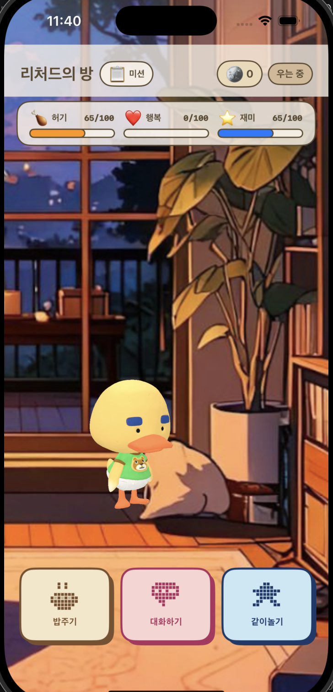

# RichardApp

RichardApp is an iOS companion app for living with Richard, a gentle duck character who roams around his room, reacts to care, chats in character, and keeps small daily routines alive through missions, snacks, coins, and mini games.

<p align="center">
  
</p>

## Features

- **3D Richard room**: A SceneKit-powered Richard model moves naturally around a cozy room background.
- **Tamagotchi-style care loop**: Hunger, happiness, and fun are tracked from 0 to 100 and saved with `UserDefaults`.
- **State-driven character behavior**: Richard can idle, play, eat, cry, miss the user, feel annoyed, sleep, or look surprised.
- **AI chat**: Richard responds through an Anthropic Messages API integration with a strict in-character Korean persona prompt.
- **Snack shop**: Spend coins on snacks that restore hunger and can raise happiness or fun.
- **Daily missions**: Attendance, outing, and walking missions reward coins.
- **Step tracking**: `CoreMotion` pedometer updates walking missions from today's steps.
- **High/Low mini game**: Guess whether the next card is higher or lower to win coins and raise fun.
- **Live Activity / Dynamic Island**: ActivityKit displays Richard's current state with pixel-art animation frames.
- **Widget target**: Includes widget-related targets and app intent scaffolding.

## Tech Stack

- Swift
- SwiftUI
- SceneKit
- ActivityKit / WidgetKit
- CoreMotion
- UserDefaults persistence
- Anthropic Messages API

## Project Structure

```text
RichardApp/
  RichardApp/              Main app source
  RichardWidget/           Widget and Live Activity extension
  RichardApp.xcodeproj     Xcode project
  docs/app-preview.png     README preview image
```

## API Key

`LLMService` does not store API keys in source code. Provide an Anthropic API key using either:

- the `ANTHROPIC_API_KEY` environment variable, or
- an `ANTHROPIC_API_KEY` value in the app bundle Info.plist at build time.

Without a key, the app still opens, but AI chat returns the built-in missing-key message.

## Build

Open `RichardApp.xcodeproj` in Xcode, select the `RichardApp` scheme, then build and run on an iOS simulator or device.

Command-line build example:

```sh
xcodebuild -project RichardApp.xcodeproj -scheme RichardApp -destination 'generic/platform=iOS' CODE_SIGNING_ALLOWED=NO build
```

## Notes

- `.DS_Store`, Xcode user data, build output, and DerivedData are ignored.
- The app uses local persistence for care stats, coins, missions, and steps.
